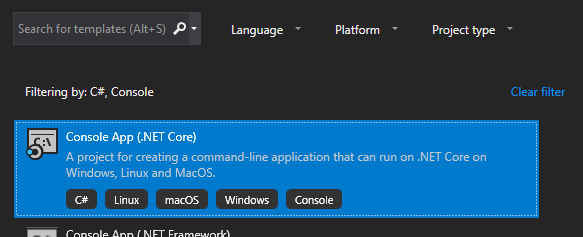
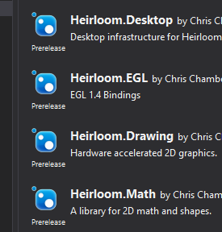
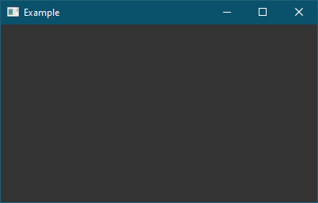
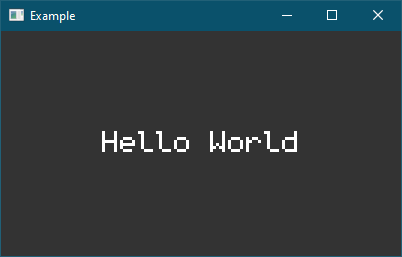

# Getting Started

Let us begin by creating a very simple application that simply opens a window 
and draws the infamous text of *"Hello World"*.

## Visual Studio

Create a new project called "HelloWorld":




These tutorials are written assuming that the program is running on 
`NET Core 2.1`. The libraries themselves are `NET Standard 2.0` compliant. They 
should work on `NET Framework 4.7.X` projects as well, but aren't part of these 
tutorials and any unexpected behaviour is unsupported at the time of writing.

Once created right click the project in the `Solution Explorer` and click on 
`Manage NuGet Packages... > Browse` and search for "Heirloom". You should see 
several projects with the naming pattern of `Heirloom.XYZ` where *XYZ* is the 
project name. I will refer to projects like `Heirloom.Math` just as `Math` to 
be concise.



For desktop applications using `Heirloom` we need to include the
`Desktop` package. We will also include additional packages for future
tutorials. Select `Desktop`, `IO` and `Sound`. By the nature of packages in 
`NET Core 2.1`  (and later), `Math`, `Drawing`, `Drawing.OpenGLES`, `OpenGLES`, 
and `GLFW` are transitively included with `Desktop`. If you're trying to use  
Heirloom in a `NET Framework 4.7.X` project, then you will need to include all 
manually.

## Command Line

```sh
$ mkdir HelloWorld
$ cd ./HelloWorld

$ dotnet new console
```

This will create a C# project file in the `HelloWorld/` directory called 
`HelloWorld.csproj`. It should also create a simple *"Hello World"* example app 
in `Program.cs`.

These tutorials are written assuming that the program is running on 
`NET Core 2.1`. The libraries themselves are `NET Standard 2.0` compliant.

For desktop applications using `Heirloom` we need to include the
`Heirloom.Desktop` package. We also include additional packages for future
tutorials.

```sh
$ dotnet add package Heirloom.Desktop
$ dotnet add package Heirloom.Sound
$ dotnet add package Heirloom.IO
```

You may want to use a pre-release version. Append `-v 1.1.1-beta` or whatever
version string you desire. See the projects on [NuGet](https://www.nuget.org/packages?q=heirloom) 
for their version numbers.

By the nature of packages in `NET Core 2.1` (and later), `Math`, `Drawing`, 
`Drawing.OpenGLES`, `OpenGLES`,  and `GLFW` are transitively included with 
`Desktop`.

## Hello World

At this point, the **Command Line** or **Visual Studio** experience should be 
more or less the same. There are obviously differences in text editing and 
other utilities but we will mostly be looking at the code. 

Now, lets open `Program.cs`. You should see something like this:

```cs
using System;

namespace HelloWorld
{
    class Program
    {
        static void Main(string[] args)
        {
            Console.WriteLine("Hello World!");
        }
    }
}
```

Now change the program to match the following:

```cs
using Heirloom.Desktop;
using Heirloom.Drawing;

namespace HelloWorld
{
    internal class Program
    {
        private static void Main(string[] args)
        {
            Application.Run(() =>
            {
                // ... application logic
            });
        }
    }
}

```

On desktop platforms, an Heirloom application **must** execute`Application.Run` 
in the main method, and should probably be the very first thing the application 
does. This is a blocking call that sets up the window system and will continue to block until all windows are closed. The delegate passed into `Run` is where we can create a window and perform drawing operations.

So, lets create a window and clear it with a dark gray color.

```cs
using Heirloom.Desktop;
using Heirloom.Drawing;

namespace HelloWorld
{
    internal class Program
    {
        private static void Main(string[] args)
        {
            Application.Run(() =>
            {
                // Create a new window
                var win = new Window(400, 225, "Example");
                
                // Get the window rendering context
                var ctx = win.RenderContext;
                ctx.ResetState(); // known bug: should not need to reset here
                
                // Clear the window
                ctx.Clear(Color.DarkGray);
                ctx.SwapBuffers();
            });
        }
    }
}
```

Lets run this program! Assuming you're using `Visual Studio`, right click the project and select `Set as StartUp Project` (if it wasn't already). Then press 
`Ctrl + F5` to build and run the program. If you're using the `Command Line`, execute `dotnet run -c Release` from the project folder.

You should see a window like the following:



Great! Albeit boring. So lets draw some text to spice it up:

```cs
using Heirloom.Math;
...
// after ctx.Clear...
var pos = new Vector(ctx.Surface.Width / 2, 88);
ctx.DrawText("Hello World", pos, Font.Default, 48, TextAlign.Center);
```



Success! In the next part, we will modify this example to show the system time 
using `GameWindow` for animated drawing.