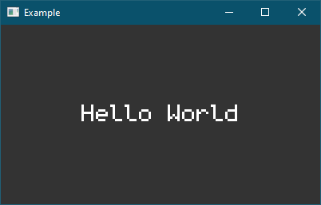

# Getting Started

In this tutorial we will create a very simple application that creates a window and displays: `"Hello World"`.

These tutorials are written assuming that the program is running on `NET Core 3.0`. The libraries themselves are `NET Standard 2.1` compliant. If you don't have .NET Core 3.0 (or newer), then you can [download it here](https://dotnet.microsoft.com/download/dotnet-core/).

## Using Visual Studio

To get started, lets create a new C# project. Choose `Console App (.NET Core)`, name it "HelloWorld" and put it somewhere on your computer:

Once created right click the project in the `Solution Explorer` and click on `Manage NuGet Packages... > Browse` and search for `Heirloom`. You should see several projects with the naming pattern of `Heirloom.XYZ` where the `XYZ` part is the project name. I will typically refer to projects like `Heirloom.Math` just as `Math` to be concise.

To create any desktop application using `Heirloom` we will need to include `Heirloom.Desktop`. This will automatically include all dependancies that `Heirloom.Desktop` requires. Thus it will also install `Heirloom.Drawing`, `Heirloom.IO` and `Heirloom.Math`.

## Command Line

```sh
$ mkdir HelloWorld
$ cd ./HelloWorld

$ dotnet new console
```

This will create a C# project file in the `HelloWorld/` directory called 
`HelloWorld.csproj`. It should also create a simple *"Hello World"* example app in `Program.cs`.

To create any desktop application using `Heirloom` we will need to include `Heirloom.Desktop`. This will automatically include all dependancies that `Heirloom.Desktop` requires. Thus it will also install `Heirloom.Drawing`, `Heirloom.IO` and `Heirloom.Math`.

```sh
$ dotnet add package Heirloom.Desktop
```

You may want to use a pre-release version (ie, alpha or beta). If you choose to do this, you'll need to use:

```sh
dotnet add package Heirloom.Desktop --version 0.9.0-alpha
```

You can find the exact version on [Nuget](https://www.nuget.org/packages?q=Heirloom).

## Hello World

At this point, the **Command Line** or **Visual Studio** experience should be more or less the same. There are obviously differences in how to go about editing code and other utilities but we will mostly be looking at the code. 

Now, lets open `Program.cs`. You should see something like this:

```cs
using System;

namespace HelloWorld
{
    class Program
    {
        static void Main(string[] args)
        {
            Console.WriteLine("Hello World!");
        }
    }
}
```

Now change the program to match the following:

```cs
using Heirloom.Desktop;
using Heirloom.Drawing;
using Heirloom.Math;

namespace HelloWorld
{
    internal class Program
    {
        private static void Main(string[] args)
        {
            Application.Run(() =>
            {
                // ... application logic
            });
        }
    }
}

```

*Note:* Due to quirks in the underlying windowing library, applications using `Heirloom.Desktop` **must call** `Application.Run` in the main method **before** using any windowing features to establish the window thread. This is a blocking call that sets up the window system and will continue to block until all windows are closed. The function passed into `Run` can be considered a pseduo main function. The function is called once the windowing system has been intitialized and you can then create a window and begin drawing on it.

So, let's create a window and clear it with a dark gray color.

```cs
using Heirloom.Desktop;
using Heirloom.Drawing;
using Heirloom.Math;

namespace HelloWorld
{
    internal class Program
    {
        private static void Main(string[] args)
        {
            Application.Run(() =>
            {
                // Create a window
                var window = new Window("Konnichiwa Sekai") { Size = (400, 200) };

                // Creates a render loop, calls OnDraw each frame.
                var loop = RenderLoop.Create(window.Graphics, OnDraw);
                loop.Start(); // Go!
            });
        }
    }
}
```

This creates a window (which is visible by default) and additionally sets up a render loop thread. This loop invokes `OnDraw` for each rendered frame. We currently have not defined the behaviour of `OnDraw` so let's do that now.

```cs
private static void OnDraw(Graphics gfx, float dt)
{
    gfx.Clear(Color.DarkGray);
}
```

Lets run this program! Assuming you're using `Visual Studio`, right click the project and select `Set as StartUp Project` (if it wasn't already). Then press `Ctrl + F5` to build and run the program. If you're using the `Command Line`, execute `dotnet run -c Release` from the project folder.

You should see a window like the following:


Great! Albeit boring. So lets draw some text to spice it up. In your `OnDraw` function, add the following lines:

```cs
var pos = new Vector(gfx.Surface.Width / 2, 78);
gfx.DrawText("Hello World", pos, Font.Default, 48, TextAlign.Center);
```



*Success!* 

In the next part, we will modify this example to draw an image and some basic shapes to the screen.
