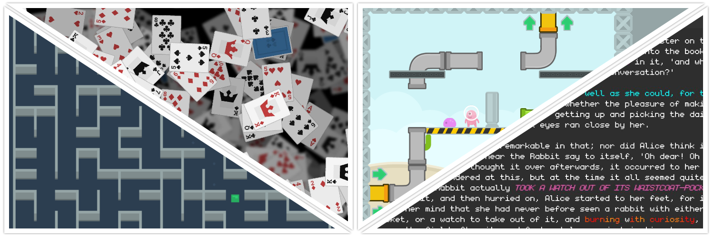

# Heirloom

A C# framework that provides *drawing, audio, mathematics, data structures and more*. Useful for prototyping and implementating games, tools and other graphical applications. Heirloom currently is supported on *Windows, Linux and Android*.

Note: The library *should* be able to run on *macOS* but I am not supporting this platform. Apple has deprecated OpenGL in addition to the fact I just don't have access to an apple computer to test. However, if someone in the larger world of the internet wants to help implement a *macOS* backend, please let me know.



I've been developing this framework with **Visual Studio 2019**. Using the `dotnet` CLI has been straight forward enough experience to build and run the examples, so using `VS Code` (or your favorite editor) should work well to contribute and/or use **Heirloom**.

The framework is built against `NET 5.0` (and `MonoAndroid10.0` on Android).

## Tutorials and Documentation

Visit the [wiki][wiki] for tutorials and documentation.

You can also find [screenshots][screenshot_dir] and [api documentation][api_dir] in the `Documentation/` directory.

## Nuget Packages

I've compiled most of the projects and created nuget packages and put them up on [Nuget][nuget_search]. They may be out of date with respect to the repository, but I will try to keep them relevant.

If you build the projects in the `Framework\` directory, it should generate the associated `*.nupkg`. You can then reference them manually if you desire.

## Building

You will need to initialize the StbSharp submodules to before building.

```sh
git submodule update --init --recursive
```

### Using Visual Studio

1. Clone this repository.
2. Open the `Heirloom.sln` in Visual Studio.
3. Build or Run Examples from the IDE
   * Ensure the configuration is set to `Release`

### Using Command Line

1. Clone this repository.
2. Build or Run Examples
   * Run `dotnet build -c Release` in the solution or project folder
   * Run `dotnet run -c Release` in any example project folder

*The projects are set to the standard `AnyCpu` configuration, but it is important to note the native binaries are actually 64-bit. This framework does not currently support 32-bit*.

## Overview

**Note:** *Some projects may exist in the the repository (especially in a development branch) that are not mentioned here. You should consider these projects as experimental or 'in early development' and not rely on them whatsoever.*

#### Heirloom

`Mathematics` - Heirloom provides a collection of mathematical data types and functions useful for 2D math. Includes tools and utilities for manipulating and creating vectors, matrices, polygons and other shapes.

`Drawing` - The heart of **Heirloom** is the hardware accelerated 2D drawing. This includes features to *draw images, text and other shapes* with **support for GLSL shaders**.

`Sound` - **Heirloom** also supports an Audio API that allows audio playback, audio groups, effect chains (such as reverb) and more. Sound data can be either streamed from disk or loaded into memory first. Audio groups allow the user to mix sounds and apply effects in bulk. This API support decoding `.ogg`, `.mp3` and `.wav` files.

`Collections` - Additionally, Heirloom gives the user access to data structures and utility functions for quality of life. For example, Heirloom contains data structures like `Grid<T>`, `BvhSpatialCollection<T>` and `Graph<T>` and functions like heuristic based search and stable sorting.

#### Heirloom.Desktop

Provides the native binaries for desktop platforms (Windows, Linux and macOS).

#### Heirloom.Android

Provides the native binaries for Android platform.

## License

See [LICENSE.md](./LICENSE.md) for complete details.

### Special Thanks

Media

* https://www.kenney.nl/
* https://datagoblin.itch.io/monogram

Software

* https://github.com/glfw/glfw
* https://github.com/nothings/stb
* https://github.com/rds1983/StbSharp
* https://github.com/mackron/miniaudio
* https://github.com/mackron/dr_libs

[stbcsharp]: https://github.com/rds1983/StbSharp
[nuget_search]: https://www.nuget.org/packages?q=heirloom
[wiki]: https://github.com/Chamberlain91/Heirloom/wiki
[screenshot_dir]: ./Documentation/Screenshots/
[api_dir]: ./Documentation/Api/