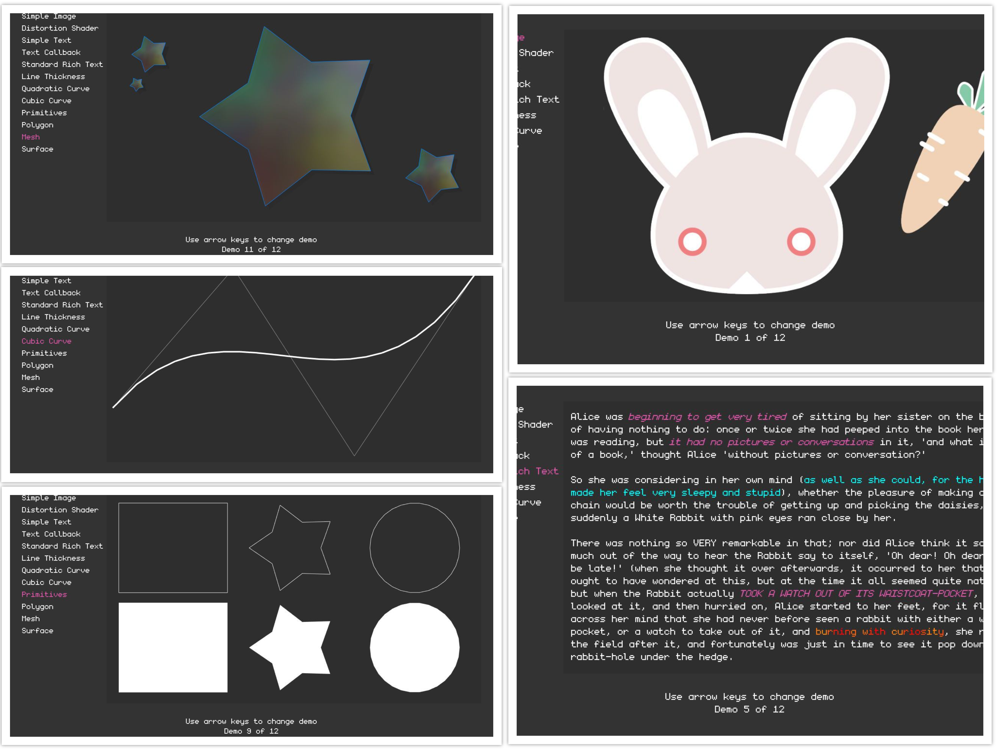

# Heirloom

A set of *C# libraries that provide drawing, audio playback, mathematics and more*. Useful for quick prototyping and implementating games and other graphical applications. Heirloom currently is supported on *Windows, Linux and macOS*.

I've been developing this framework with **Visual Studio 2019**. Using the `dotnet` CLI has been straight forward enough experience to build and run the examples so using `VS Code` (or your favorite editor) and basic comprehension on using a terminal should work well to contribute or use Heirlooom.

Libraries are `NET Standard 2.1` compiant and examples run on `NET Core 3.0`. 

## Tutorials and Documentation

[Tutorials](./Documentation/Tutorials) and [autogenerated documentation](./Documentation/Api) can be found [here](./Documentation/).

## Nuget Packages

I've compiled most of the projects and created nuget packages and put them up on [Nuget][nuget_search]. They may be out of date with respect to the repository, but I will try to keep them relevant.

## Building

### Using Visual Studio

1. Clone this repository.
2. Open the `Heirloom.sln` in Visual Studio.
3. Build or Run Examples from the IDE
   * Ensure the configuration is set to `Release`

### Using Command Line

1. Clone this repository.
2. Build or Run Examples
   * Run `dotnet build -c Release` in the solution folder
   * Run `dotnet run -c Release` in any example project folder

*The projects are set to the standard `AnyCpu` platform, but it is important to note the GLFW binaries are 64 bit.*

## Overview

A breif overview (in bullet point form) of each project and their notable features. The specifics may be a little off to compared actual code but since these descriptions are fairly abstract is should be largely the same. Some projects will be marked `(Alpha)` or `(Beta)`. These represent my confidence in their stability and likelyhood to remain with the same API, respectively.

**Note:** *Some projects may exist in the the repository that are not mentioned here. You should consider these projects as pre-alpha 'in early development' and not rely on them.*

### Drawing

A hardware accelerated 2D drawing library.

* Images and Sprites
    + JPEG and PNG image encode and decode
    + Partial support for Aseprite format
* Text Rendering w/ Truetype Fonts
* Offscreen Rendering
* Composition
    + Blending Operations (Alpha, Additive, Multiply, etc)
    + GLSL based Vertex and Fragment Shaders
* Image Atlas / Rectangle Packing
    + Improves rendering performance by batching images.

**Note:** Image and font support is implemented by a [C to C# machine-port of
STB][stbcsharp].

### Sound

A cross platform audio library (built on top of `miniaudio.dll`).

* Supports Decoding MP3, Vorbis, FLAC and WAV
* Streaming Audio Sources
* In-Memory Audio Clips

### Math

A collection of mathematical data types and functions useful for 2D math.

* General Computation
  * Trig
  * Interpolation (Linear, Cosine, Bezier, etc)
  * Noise (Value, Perlin and Simplex)
  * Vector and Matrix
* Shapes
    * Rectangle
    * Circle
    * Triangle
    * Polygons (Simple and Convex)
    * Line Segment
* Polygon Tools
    * Polygon Convex Decomposition
    * Polygon Triangulation
* Collision Detection
    * Overlap Detection
    * Contact Manifolds

### Collections

A collection of data structures and other algorithms.

* Heap (Min and Max)
* Graph
* Search
    + Heuristic
    + Depth First
    + Breadth First
* Alternative Sort Algorithms
* Type Dictionary
* Extension Methods

### Collections.Spatial

A collection of data structures for spatially accelerated queries, such as grids.

* Grid (Finite and Sparse)
* Broad Phase (Bounding Box Spatial Query)
* etc

### IO

Utilities for file access or other useful mechanisms for data manipulation.

* BitField (compact 8 bits of boolean state)
* Unified File Access
  * Assembly Embedded Files
  * Files on Disk

### Desktop

Provides tools for managing windows, monitors and user input.

* Windows
  * Drawing
  * Events
  * User Input
    * Keyboard
    * Mouse
  * Configurable Cursors and Icons
* Monitors
  * Fullscreen Windows

## License

See [LICENSE.md](./LICENSE.md) for complete details.

### Special Thanks

Media

* https://www.kenney.nl/
* https://datagoblin.itch.io/monogram

Software

* https://github.com/glfw/glfw
* https://github.com/nothings/stb
* https://github.com/rds1983/StbSharp
* https://github.com/dr-soft/miniaudio

[stbcsharp]: https://github.com/rds1983/StbSharp
[nuget_search]: https://www.nuget.org/packages?q=heirloom
